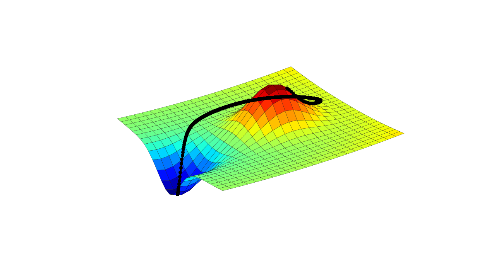

# Optimization-Algorithms

Welcome to the Optimization-Algorithms repository, where we explore various optimization algorithms. This repository includes implementations of different algorithms, such as Newton's method, BFGS, and gradient descent.

## Optimization Algorithms

### Newton
Newton's method is a powerful optimization technique that aims to find the minimum of a function by iteratively approximating it with a quadratic function.

### BFGS
The Broyden-Fletcher-Goldfarb-Shanno (BFGS) algorithm is another optimization method used to solve unconstrained nonlinear optimization problems. It updates an approximation of the Hessian matrix to iteratively refine the solution.

### Gradient Descent
Gradient descent is a popular optimization algorithm for minimizing a function by adjusting the parameters iteratively in the direction of the steepest descent.

## Multiobjective Optimization Algorithms

In addition to the single-objective optimization algorithms, this repository also includes implementations of multiobjective optimization algorithms:

### Electre
The Electre method is used for solving multiobjective optimization problems. It involves a decision matrix and criteria to rank and select alternatives.

### TOPSIS
The Technique for Order of Preference by Similarity to Ideal Solution (TOPSIS) is used to rank alternatives in a multiobjective optimization problem. This repository calculates TOPSIS values for different norms, including L1, L2, and L∞.

### NSGA II
This implementation of the Non-Sorting Genetic Algorithm II (NSGA II) is sourced from [MathWorks](https://www.mathworks.com/matlabcentral/fileexchange/65494-non-sorting-genetic-algorithm-ii-nsga-ii). The source code and an optimization problem example (ProblemaNSGA2.m) are included. Note that the code comments are in Spanish.

Enjoy exploring these optimization algorithms and their applications! You can find example problems and practical solutions in the included source code.

For more information or questions, please contact the repository owner.

